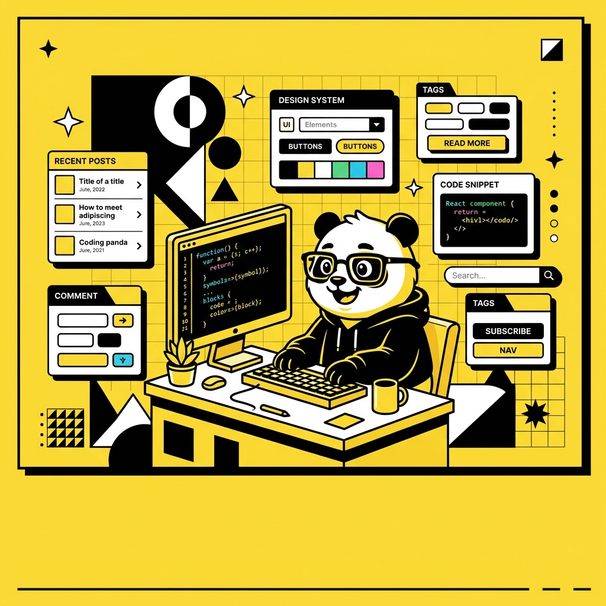
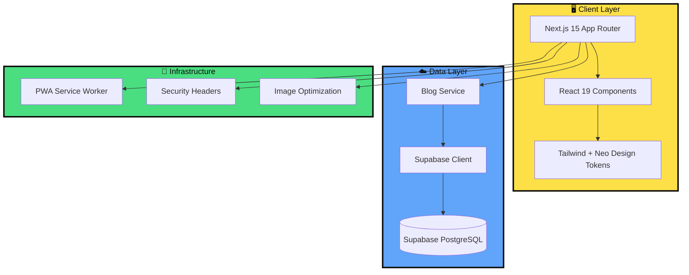

<br><div align="center">



# 🐼 Coding Panda Blog

### **The NeoBrutalist Blog Platform That Developers Actually Want to Use**

*Built with thick borders, flat shadows, and zero compromises.*

[](https://nextjs.org/)
[](https://www.typescriptlang.org/)
[](https://tailwindcss.com/)
[](https://supabase.com/)
[](https://web.dev/progressive-web-apps/)
[](https://jestjs.io/)
[](LICENSE)

<br />

[**🚀 Live Demo**](https://codingpanda.dev) · [**📖 Read the Blog**](https://codingpanda.dev) · [**🐛 Report Bug**](https://github.com/XDEV200/coding-panda-blog/issues) · [**✨ Request Feature**](https://github.com/XDEV200/coding-panda-blog/issues)

<br />

---

</div>

## 🎯 Why Coding Panda?

> Most blog templates look the same — generic, forgettable, lifeless.
>
> **Coding Panda is different.**
>
> It's opinionated. It's bold. It's the blog you actually *remember.*

<table>
<tr>
<td width="50%">

### 😴 What Every Other Blog Looks Like

- Generic sans-serif fonts
- Flat, forgettable cards
- No personality
- "Just another blog template"
- Static content, no CMS

</td>
<td width="50%">

### 🐼 What Coding Panda Looks Like

- **Archivo Black** headings that punch through the screen
- **4px flat shadows** that make every element pop
- **NeoBrutalist design** that people screenshot and share
- **Supabase-powered** real-time content
- **90%+ test coverage** because you ship what works

</td>
</tr>
</table>

<br />

## ⚡ Get Running in 30 Seconds

```bash
# Clone it
git clone https://github.com/XDEV200/coding-panda-blog.git
cd coding-panda-blog

# Install dependencies
npm install

# Set up environment (Supabase credentials)
cp .env.example .env.local

# Launch 🚀
npm run dev
```

Open [http://localhost:3000](http://localhost:3000) and witness the brutalism.

<br />

## 🏗️ Architecture — Clean, Not Clever



<br />

## 🎨 The NeoBrutalist Design System

This isn't a theme — it's a **design language.** Every pixel is intentional.

<table>
<tr>
<td align="center" width="25%">

### 🎯 Borders

```css
border: 2px solid #0A0A0A
```

Thick. Unapologetic.
Every surface has them.

</td>
<td align="center" width="25%">

### 🖤 Shadows

```css
box-shadow: 4px 4px 0px #0A0A0A
```

Flat. No blur. No gradients.
They *move* on hover.

</td>
<td align="center" width="25%">

### 🔤 Typography

```
Archivo Black — Headings
Space Grotesk — Body
```

Heavy meets geometric.
Readable at any size.

</td>
<td align="center" width="25%">

### 🎨 Palette

```
#FDE047  — Panda Yellow
#0A0A0A  — Ink Black
#FAFAFA  — Paper White
+ 5 accent colors
```

</td>
</tr>
</table>

### Color System

| Token | Hex | Usage |
|-------|-----|-------|
| 🟡 `retro-yellow` | `#FDE047` | Brand, CTAs, highlights |
| ⚫ `retro-black` | `#0A0A0A` | Text, borders, shadows |
| ⚪ `retro-white` | `#FAFAFA` | Backgrounds, cards |
| 🩷 `retro-pink` | `#F472B6` | Category: Design |
| 🔵 `retro-blue` | `#60A5FA` | Category: Tutorials |
| 🟢 `retro-green` | `#4ADE80` | Category: Accessibility |
| 🟠 `retro-orange` | `#FB923C` | Category: Announcements |
| 🟣 `retro-purple` | `#C084FC` | Category: AI/ML |

### Shadow Hierarchy

```
neo        →  4px 4px 0px  →  Default state
neo-lg     →  6px 6px 0px  →  Featured cards
neo-xl     →  8px 8px 0px  →  Hero elements
neo-hover  →  2px 2px 0px  →  Active/pressed state
```

<br />

## 🧩 Component Library

Every component follows the Neo design system. No ad-hoc styles.

```
components/
├── ui/
│   ├── Badge.tsx          # 7 color-coded category pills
│   ├── Button.tsx         # 3 variants × 3 sizes with shadow animations
│   └── ThemeToggle.tsx    # Light/dark mode with smooth transitions
├── blog/
│   ├── BlogCard.tsx       # Standard + featured layouts
│   ├── BlogGrid.tsx       # Responsive grid with featured-first row
│   └── CategoryFilter.tsx # aria-pressed filter buttons
└── layout/
    ├── Navbar.tsx          # Sticky yellow navbar with dynamic theme
    └── Footer.tsx          # Dark footer with dynamic year
```

<br />

## 🗂️ Full Project Structure

```
coding-panda-blog/
├── 📁 app/                          # Next.js 15 App Router
│   ├── layout.tsx                   # Root layout — PWA metadata, ThemeProvider
│   ├── globals.css                  # Design tokens + Google Fonts
│   ├── page.tsx                     # Blog listing with live category filtering
│   ├── not-found.tsx                # Custom 404 page
│   ├── [slug]/page.tsx              # Dynamic blog post route (SSG)
│   └── api/blogs/route.ts           # REST API: GET /api/blogs?category=X
│
├── 📁 components/                   # UI component library
│   ├── ThemeProvider.tsx             # next-themes wrapper
│   ├── ui/                          # Atomic design components
│   ├── blog/                        # Blog-specific components
│   └── layout/                      # App shell (Navbar, Footer)
│
├── 📁 lib/                          # Business logic
│   ├── posts.ts                     # Data access layer (async, Supabase-backed)
│   └── utils.ts                     # Pure utilities: cn, formatDate, slugify, truncate
│
├── 📁 services/                     # Service layer
│   └── blogService.ts               # Supabase CRUD operations
│
├── 📁 types/                        # TypeScript interfaces
│   └── blog.ts                      # BlogPost, BlogCategory
│
├── 📁 public/                       # Static assets
│   ├── manifest.json                # PWA manifest
│   ├── sw.js                        # Service worker (auto-generated)
│   └── icons/                       # App icons (192, 512, apple-touch)
│
└── 📁 __tests__/                    # Test suite (90%+ coverage)
    ├── lib/                         # Unit tests for utilities & data
    ├── components/                  # Component render & interaction tests
    ├── services/                    # Service layer tests
    └── app/                         # Page & API route tests
```

<br />

## 🛡️ Security — Not an Afterthought

Every request is hardened with production-grade security headers:

| Header | Value | Why |
|--------|-------|-----|
| `X-Content-Type-Options` | `nosniff` | Prevents MIME-type sniffing attacks |
| `X-Frame-Options` | `DENY` | Blocks clickjacking via iframes |
| `X-XSS-Protection` | `1; mode=block` | Legacy XSS filter activation |
| `Referrer-Policy` | `strict-origin-when-cross-origin` | Controls referrer data leakage |
| `Permissions-Policy` | `camera=(), microphone=(), geolocation=()` | Disables unnecessary browser APIs |
| `poweredByHeader` | `false` | Hides Next.js fingerprint |

All external links use `rel="noopener noreferrer"`. No information leaks.

<br />

## ♿ Accessibility — WCAG 2.1 AA

This blog is built for **everyone**, not just sighted mouse-users:

- ✅ **Semantic HTML** — `header`, `nav`, `main`, `article`, `footer`
- ✅ **ARIA landmarks** — Every navigation region is labeled
- ✅ **`aria-pressed`** — Category filter buttons communicate state
- ✅ **`aria-live="polite"`** — Post count updates announced to screen readers
- ✅ **Focus-visible rings** — Every interactive element has keyboard focus styles
- ✅ **Color contrast** — All text meets WCAG AA contrast ratios
- ✅ **Reduced motion** — Animations respect `prefers-reduced-motion`

<br />

## 📱 PWA — Install It. Use It Offline.

Coding Panda works as a **Progressive Web App** out of the box:

| Feature | Implementation |
|---------|---------------|
| 🔌 Offline Support | `NetworkFirst` caching via Workbox |
| 📲 Installable | Full `manifest.json` with icons |
| ⚡ App Shortcuts | Home page shortcut in manifest |
| 🎨 Theme Color | `#FDE047` matches the Panda Yellow brand |
| 🔄 Auto-update | `skipWaiting` + `register: true` |

<br />

## 🧪 Testing — 90%+ Coverage or It Doesn't Ship

We don't guess. We test. Every component, every function, every edge case.

```bash
# Run the full test suite with coverage
npm test

# Watch mode for development
npm run test:watch

# CI mode with enforced thresholds
npm run test:ci
```

### Coverage Thresholds

| Metric | Threshold |
|--------|-----------|
| Lines | ≥ 90% |
| Functions | ≥ 90% |
| Statements | ≥ 90% |
| Branches | ≥ 85% |

### What We Test

| Layer | Tests | What's Covered |
|-------|-------|----------------|
| `lib/utils.ts` | 20 tests | All pure functions, edge cases, type coercion |
| `lib/posts.ts` | 18 tests | Data integrity, async operations, error paths |
| UI Components | 40+ tests | Render, variants, a11y attributes, interactions |
| Blog Components | 20+ tests | Grid layouts, filtering, featured cards |
| Pages | 10+ tests | State management, loading states, aria-live |
| API Routes | 8+ tests | Status codes, filtering, cache headers, schema |

<br />

## 🔌 API Reference

### `GET /api/blogs`

Returns all posts, sorted by date (newest first).

### `GET /api/blogs?category=tutorials`

Filter by category. Available categories: `design`, `tutorials`, `accessibility`, `announcements`.

**Response:**

```json
{
  "posts": [
    {
      "slug": "building-neobrutalist-components",
      "title": "Building NeoBrutalist Components",
      "excerpt": "A deep dive into thick borders and flat shadows...",
      "category": "tutorials",
      "tags": ["react", "css", "design-system"],
      "readTime": 5,
      "featured": true
    }
  ],
  "total": 1
}
```

<br />

## 🧰 Tech Stack Deep-Dive

| Technology | Version | Why This? |
|-----------|---------|-----------|
| **Next.js** | 15 | App Router, RSC, image optimization, SSG |
| **React** | 19 | Latest hooks, server components support |
| **TypeScript** | 5.7 | Type safety across every layer |
| **Tailwind CSS** | 3.4 | Design tokens as config, JIT compilation |
| **Supabase** | 2.x | PostgreSQL + real-time subscriptions + auth |
| **next-pwa** | 5.6 | Zero-config PWA with Workbox |
| **next-themes** | 0.4 | Flicker-free dark mode |
| **Lucide React** | 0.473 | Consistent, tree-shakeable icons |
| **date-fns** | 4.1 | Modular date formatting |
| **Jest** | 29 | Fast, reliable test runner |
| **Testing Library** | 16 | User-centric component tests |

<br />

## 🚀 Extending Coding Panda

### Adding a Blog Post

Blog posts are stored in **Supabase** and fetched via the `blogService`. Add a row to the `posts` table with:

```typescript
{
  slug: "your-post-slug",
  title: "Your Post Title",
  excerpt: "A brief description...",
  content: "Full markdown content...",
  category: "tutorials",
  tags: ["react", "nextjs"],
  readTime: 5,
  coverColor: "#60A5FA",
  featured: false
}
```

### Adding a Category

1. Add posts with the new `category` string in Supabase
2. Add a colour mapping in `components/ui/Badge.tsx` → `CATEGORY_VARIANT_MAP`
3. The `CategoryFilter` auto-discovers categories from the data

### Swapping the Backend

The `blogService.ts` is the **only** file that talks to Supabase. Swap it for any backend:

```
blogService.ts  →  Your CMS / REST API / GraphQL / local MDX
     ↓
  lib/posts.ts  →  Same API, same types, zero component changes
     ↓
  Components    →  They never know the difference
```

<br />

## 📜 Available Scripts

| Command | Description |
|---------|-------------|
| `npm run dev` | Start dev server with HMR |
| `npm run build` | Production build + PWA service worker |
| `npm start` | Start production server |
| `npm test` | Run all tests with coverage report |
| `npm run test:watch` | Tests in watch mode |
| `npm run test:ci` | CI tests with enforced 90% threshold |
| `npm run lint` | ESLint |

<br />

## 🤝 Contributing

Contributions, issues, and feature requests are welcome!

1. **Fork** the repo
2. **Create** your feature branch (`git checkout -b feature/awesome-feature`)
3. **Commit** your changes (`git commit -m 'Add awesome feature'`)
4. **Push** to the branch (`git push origin feature/awesome-feature`)
5. **Open** a Pull Request

<br />

## 📄 License

This project is licensed under the **MIT License** — see the [LICENSE](LICENSE) file for details.

<br />

---

<div align="center">

<br />

**Built with 🖤 and thick borders by [XDEV200](https://github.com/XDEV200)**

*If this project helped you, consider giving it a ⭐ — it means more than you think.*

<br />

[](https://star-history.com/#XDEV200/coding-panda-blog&Date)

</div>
